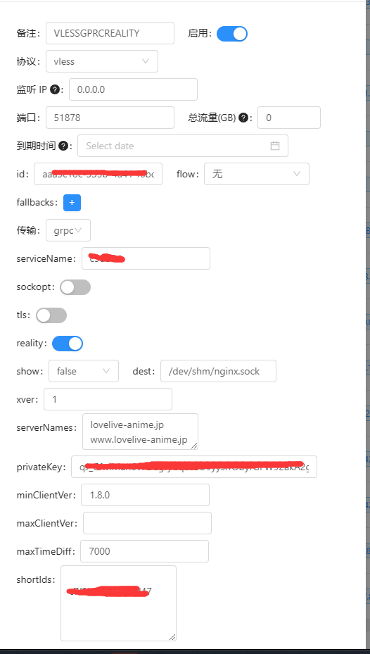
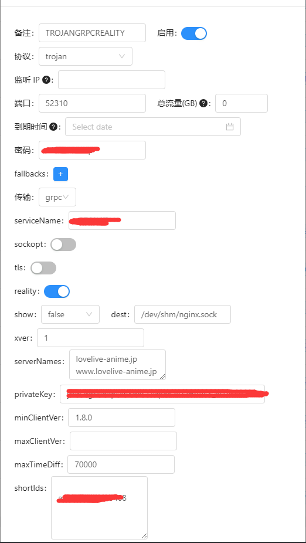

xray-ui 面板配置 reality

```bash
# 生成 Private key 与 Public key
# 两种方案
# 1、 xray 客户端生成  amd64 arm64 
/usr/local/xray-ui/bin/xray-linux-amd64 x25519
# 更新xray-ui 到最新版本
 xray-ui x25519
 # shortIds 生成  0 到 f，长度为 2 的倍数，长度上限为 16，或执行 openssl rand -hex 8 生成 可以为空不填 可以多行
                     "shortIds": [ // 客户端可用的 shortId 列表，可用于区分不同的客户端
                        "", // 若有此项，客户端 shortId 可为空
                        "a1", // 0 到 f，长度为 2 的倍数，长度上限为 16，或执行 openssl rand -hex 8 生成
                        "bc19",
                        "b2da06",
                        "2d940fe6",
                        "b85e293fa1",
                        "4a9f72b5c803",
                        "19f70b462cea5d",
                        "6ba85179e30d4fc2"
                    ]
```

dest 回源到自己nginx 服务器 用自己域名访问不会报证书问题
nginx.conf 配置

```nginx
user nginx;
worker_processes auto;

error_log /var/log/nginx/error.log notice;
pid /var/run/nginx.pid;

events {
    worker_connections 1024;
}

http {
    log_format main '[$time_local] $proxy_protocol_addr "$http_referer" "$http_user_agent"';
    access_log /var/log/nginx/access.log main;

    map $http_upgrade $connection_upgrade {
        default upgrade;
        ""      close;
    }

    map $proxy_protocol_addr $proxy_forwarded_elem {
        ~^[0-9.]+$        "for=$proxy_protocol_addr";
        ~^[0-9A-Fa-f:.]+$ "for=\"[$proxy_protocol_addr]\"";
        default           "for=unknown";
    }

    map $http_forwarded $proxy_add_forwarded {
        "~^(,[ \\t]*)*([!#$%&'*+.^_`|~0-9A-Za-z-]+=([!#$%&'*+.^_`|~0-9A-Za-z-]+|\"([\\t \\x21\\x23-\\x5B\\x5D-\\x7E\\x80-\\xFF]|\\\\[\\t \\x21-\\x7E\\x80-\\xFF])*\"))?(;([!#$%&'*+.^_`|~0-9A-Za-z-]+=([!#$%&'*+.^_`|~0-9A-Za-z-]+|\"([\\t \\x21\\x23-\\x5B\\x5D-\\x7E\\x80-\\xFF]|\\\\[\\t \\x21-\\x7E\\x80-\\xFF])*\"))?)*([ \\t]*,([ \\t]*([!#$%&'*+.^_`|~0-9A-Za-z-]+=([!#$%&'*+.^_`|~0-9A-Za-z-]+|\"([\\t \\x21\\x23-\\x5B\\x5D-\\x7E\\x80-\\xFF]|\\\\[\\t \\x21-\\x7E\\x80-\\xFF])*\"))?(;([!#$%&'*+.^_`|~0-9A-Za-z-]+=([!#$%&'*+.^_`|~0-9A-Za-z-]+|\"([\\t \\x21\\x23-\\x5B\\x5D-\\x7E\\x80-\\xFF]|\\\\[\\t \\x21-\\x7E\\x80-\\xFF])*\"))?)*)?)*$" "$http_forwarded, $proxy_forwarded_elem";
        default "$proxy_forwarded_elem";
    }

    server {
        listen 80;
        return 301 https://$host$request_uri;
    }

    server {
        #listen              127.0.0.1:8003 ssl http2 proxy_protocol;
        #set_real_ip_from    127.0.0.1;
        listen              unix:/dev/shm/nginx.sock ssl http2 proxy_protocol;
        set_real_ip_from    unix:;

        ssl_certificate     /etc/ssl/private/fullchain.cer;
        ssl_certificate_key /etc/ssl/private/private.key;

        ssl_protocols       TLSv1.2 TLSv1.3;
        ssl_ciphers         TLS13_AES_128_GCM_SHA256:TLS13_AES_256_GCM_SHA384:TLS13_CHACHA20_POLY1305_SHA256:ECDHE-ECDSA-AES128-GCM-SHA256:ECDHE-ECDSA-AES256-GCM-SHA384:ECDHE-ECDSA-CHACHA20-POLY1305;

        ssl_session_timeout 1d;
        ssl_session_cache   shared:SSL:10m;
        ssl_session_tickets off;

        ssl_stapling        on;
        ssl_stapling_verify on;
        resolver            1.1.1.1 valid=60s;
        resolver_timeout    2s;

        location / {
            sub_filter                         $proxy_host $host; # xray 非标准端口 改成 $proxy_host $http_host; 这样机可以域名加端口实现完整访问 
            sub_filter_once                    off;

            proxy_pass                         https://www.lovelive-anime.jp;
            proxy_set_header Host              $proxy_host;

            proxy_http_version                 1.1;
            proxy_cache_bypass                 $http_upgrade;

            proxy_ssl_server_name              on;

            proxy_set_header Upgrade           $http_upgrade;
            proxy_set_header Connection        $connection_upgrade;
            proxy_set_header X-Real-IP         $proxy_protocol_addr;
            proxy_set_header Forwarded         $proxy_add_forwarded;
            proxy_set_header X-Forwarded-For   $proxy_add_x_forwarded_for;
            proxy_set_header X-Forwarded-Proto $scheme;
            proxy_set_header X-Forwarded-Host  $host;
            proxy_set_header X-Forwarded-Port  $server_port;

            proxy_connect_timeout              60s;
            proxy_send_timeout                 60s;
            proxy_read_timeout                 60s;

            resolver 1.1.1.1;
        }
    }
}

```

面板配置示例：






客户端配置

1、Clash.Meta

 Clash.Meta 不能对vless-h2-reality测速

```yaml

proxies:
  - name: "vless-reality-vision"
    type: vless
    server:  127.0.0.1
    port: 36712
    uuid: uuid
    network: tcp
    tls: true
    udp: true
    flow: xtls-rprx-vision
    servername: www.lovelive-anime.jp
    reality-opts:
      public-key: publicKey
      short-id: shortIds

  - name: "vless-reality-grpc"
    type: vless
    server: 127.0.0.1
    port: 51878
    uuid: uuid
    network: grpc
    tls: true
    udp: true
    flow:
    # skip-cert-verify: true
    servername: www.lovelive-anime.jp
    grpc-opts:
      grpc-service-name: "path"
    reality-opts:
      public-key: publicKey
      short-id: shortIds

  - name: trojan-reality-grpc
    server: 127.0.0.1
    port: 52310
    type: trojan
    password: "password"
    network: grpc
    alpn:
      - h2
    sni: www.lovelive-anime.jp
    flow:
    skip-cert-verify: false
    udp: true
    grpc-opts:
      grpc-service-name: "path"
    reality-opts:
      public-key: publicKey
      short-id: shortIds

```

2 xray 原生配置参考:

`https://github.com/chika0801/Xray-examples`
